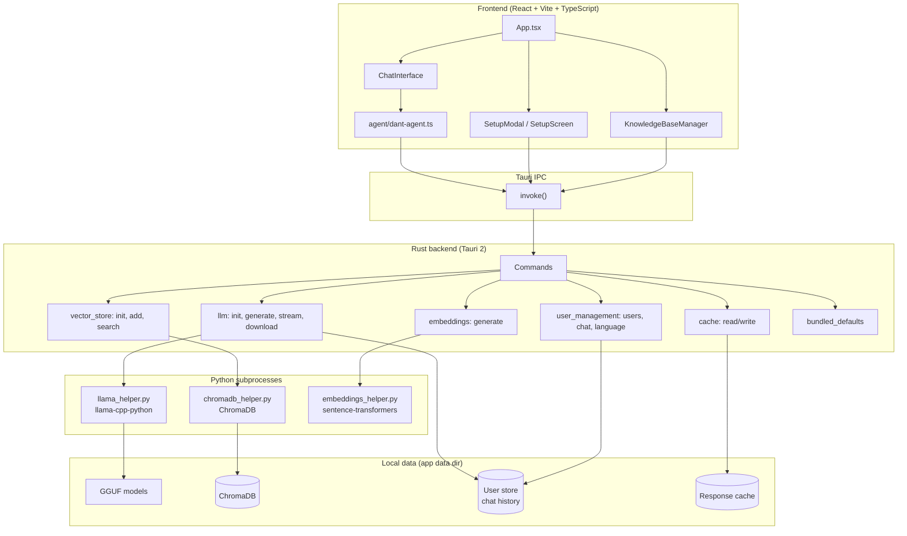

# Confidant Desktop App — Architecture

High-level tech stack and data flow for the desktop application (Tauri 2 + React + Rust + Python).

---

## Architecture diagram

---

## Layer summary

| Layer | Tech | Responsibility |
|-------|------|-----------------|
| **Frontend** | React 18, TypeScript, Vite | UI, chat interface, setup flows, agent orchestration (RAG + LLM), i18n |
| **Bridge** | Tauri IPC | `invoke()` from frontend to Rust commands; no direct Python from UI |
| **Backend** | Rust (Tauri 2) | Command handlers, process lifecycle, file I/O, spawning Python helpers |
| **ML / RAG** | Python (subprocess) | LLM (llama-cpp-python + GGUF), embeddings (sentence-transformers), vector store (ChromaDB) |
| **Data** | Local files | App data dir: GGUF models, ChromaDB DB, user store, response cache |

---

## Key flows

1. **Chat (with RAG)**  
   User message → `DantAgent.processQuery()` → optional cache lookup → `invoke('search_similar')` → Rust → Python (ChromaDB + embeddings) → Rust → `invoke('generate_text_stream')` → Rust → Python (llama-cpp-python) → streamed response back to UI.

2. **Setup**  
   Model path / KB options → `invoke('initialize_model')` or `invoke('initialize_vector_store')` / `add_documents` → Rust runs or spawns Python; UI shows progress and status.

3. **User & persistence**  
   Profiles, password, language → `user_management` commands. Chat history and response cache → Rust + local files (no Python).

---

## Repo layout (desktop)

| Path | Purpose |
|------|---------|
| `desktop/src/` | React app: `App.tsx`, `components/`, `agent/`, `config/`, `i18n/`, `knowledge/` |
| `desktop/src-tauri/src/` | Rust: `main.rs` (commands), `llm.rs`, `vector_store.rs`, `embeddings.rs`, `user_management.rs`, `cache.rs`, `python_bundle.rs` |
| `desktop/src-tauri/scripts/` | Python: `llama_helper`, `chromadb_helper`, `embeddings_helper` |

---

*See also: [desktop/README.md](../desktop/README.md), [CONTRIBUTING.md](../CONTRIBUTING.md).*
